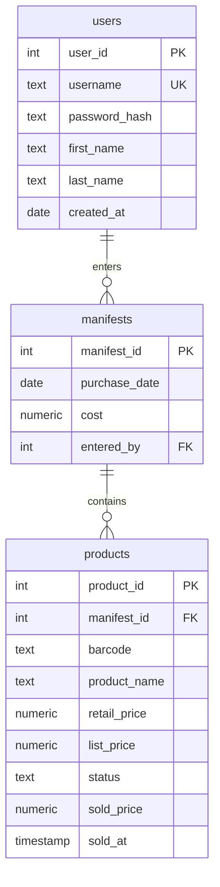

# Inventory API — Schema

## Diagram



## Tables

```
users
  user_id        INTEGER        PK
  username       TEXT           UNIQUE NOT NULL
  password_hash  TEXT           NOT NULL
  first_name     TEXT           NOT NULL
  last_name      TEXT           NOT NULL
  created_at     DATE           NOT NULL

manifests
  manifest_id    INTEGER        PK
  purchase_date  DATE           NOT NULL
  cost           NUMERIC(10,2)  NOT NULL
  entered_by     INTEGER        NOT NULL  FK → users(user_id)

products
  product_id     INTEGER        PK
  manifest_id    INTEGER        NOT NULL  FK → manifests(manifest_id)
  barcode        TEXT           NOT NULL
  product_name   TEXT           NOT NULL
  retail_price   NUMERIC(10,2)  NOT NULL
  list_price     NUMERIC(10,2)  NOT NULL
  status         TEXT           NOT NULL  CHECK (status IN ('available', 'sold', 'not_available', 'deleted'))
  sold_price     NUMERIC(10,2)  NULL
  sold_at        TIMESTAMP      NULL
```

## Indexes

```
products(manifest_id)   — joins and per-manifest profit queries
products(status)        — available, sold, not_available and deleted filters
products(barcode)       — lookup by scan
```

## Design decisions

- **Sale info lives on the product row, not a separate table.** Each item sells
  exactly once and is never deleted. If returns or resale ever became a thing,
  sales would move to their own table.
- **Retail price is per product, not per manifest.** The manifest's total
  retail value is derived (`SUM(retail_price)`), not stored.
- **Manifest "items" is a relationship, not a column.** Products point at
  their manifest via `manifest_id`.
- **Money is `NUMERIC(10,2)`, never float.** Float can't represent $0.10
  exactly; totals drift.
- **`status` is constrained by a CHECK**, so only `available` and `sold` can
  exist in the column.
- **Integer primary keys, not usernames.** Usernames change; IDs don't, and
  every FK depends on that.