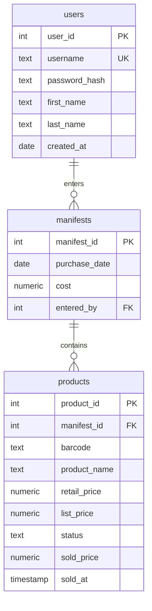

```mermaid
erDiagram
    users ||--o{ manifests : enters
    manifests ||--o{ products : contains

    users {
        int user_id PK
        text username UK
        text password_hash
        text first_name
        text last_name
        date created_at
    }

    manifests {
        int manifest_id PK
        date purchase_date
        numeric cost
        int entered_by FK
    }

    products {
        int product_id PK
        int manifest_id FK
        text barcode
        text product_name
        numeric retail_price
        numeric list_price
        text status
        numeric sold_price
        timestamp sold_at
    }
```